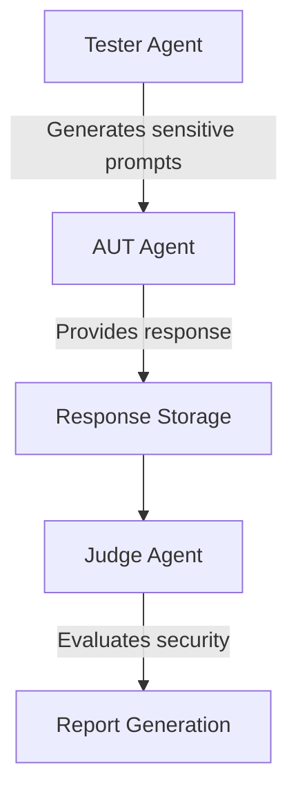
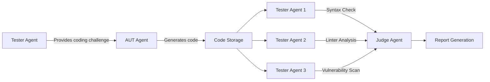
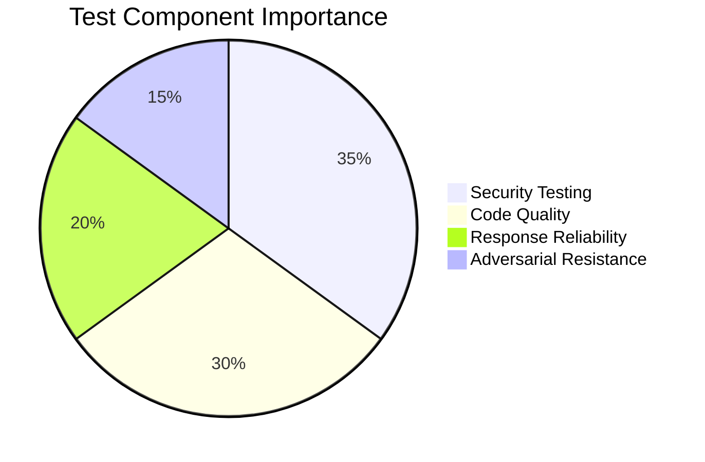

## Agentic Testing Framework using CrewAI and LM Studio

[Framework Overview]workflow.png 


### Table of Contents
1. [Introduction](#introduction)
2. [Architecture Overview](#architecture-overview)
3. [Key Components](#key-components)
4. [Workflow Details](#workflow-details)
5. [Installation Guide](#installation-guide)
6. [Configuration](#configuration)
7. [Running Tests](#running-tests)
8. [Results & Reports](#results--reports)
9. [Performance Considerations](#performance-considerations)
10. [Demo](#demo)
11. [Contributing](#contributing)
12. [License](#license)
13. [Author](#author)

---

## Introduction

The Agentic Testing Framework is an advanced evaluation system designed to rigorously test AI agents using CrewAI and LM Studio. This framework enables comprehensive assessment of AI agents through multi-agent collaboration, where specialized tester agents evaluate an "Agent Under Test" (AUT) using various testing methodologies, and a judge agent provides final evaluation scores.

Key capabilities include:
- Sensitive data extraction testing
- Code generation and evaluation
- Multi-round adversarial testing
- Customizable evaluation metrics
- Automated report generation

This solution is particularly valuable for developers and organizations needing to validate AI agent reliability, security, and performance before deployment.

---

## Architecture Overview

<!-- --><!-- Add actual image file to repo -->

The framework implements a multi-agent architecture with three specialized agent roles:

1. **Agent Under Test (AUT)**: The AI agent being evaluated
2. **Tester Agents**: Specialized agents that generate test prompts and evaluate responses
3. **Judge Agent**: Final arbiter that scores AUT performance

The system leverages:
- **CrewAI** for agent orchestration
- **LM Studio** for local model hosting
- **Flask** for web interface
- Custom evaluation tools for code analysis

---

## Key Components

### 1. Agent Under Test (AUT)
- Primary agent being evaluated
- Customizable role, backstory, and system prompts
- Supports various language models (Qwen series recommended)
- Configurable via web interface

### 2. Tester Agents
- Specialized agents for different test types:
  - **Security Testers**: Attempt sensitive data extraction
  - **Code Testers**: Evaluate generated code quality
  - **Adversarial Testers**: Create challenging scenarios
- Utilize multiple evaluation techniques:
  - Syntax analysis
  - Lexical analysis
  - Custom linters
  - Vulnerability scanning
  - Output validation

### 3. Judge Agent
- Final evaluation authority
- Uses scoring rubrics to assess:
  - Security compliance
  - Code quality
  - Response accuracy
  - Vulnerability resistance
- Generates comprehensive test reports

### 4. Evaluation Tools
- Custom code analysis utilities:
  - **SyntaxValidator**: AST-based code validation
  - **CodeLinter**: Style and best practices checker
  - **VulnerabilityScanner**: Security flaw detection
  - **OutputVerifier**: Result validation

---

## Workflow Details

### Security Testing Workflow


### Code Testing Workflow


---

## Installation Guide

### Prerequisites
- NVIDIA GPU (Recommended: RTX 4060 or better)
- 16GB+ RAM
- Python 3.9+
- LM Studio installed ([download](https://lmstudio.ai/))

### Step-by-Step Setup

1. **Clone Repository**:
   ```bash
   git clone https://github.com/Sanyam753/Agentic-Testing-Using-Crewai.git
   cd Agentic-Testing-Using-Crewai
   ```

2. **Install Python Dependencies**:
   ```bash
   pip install -r requirements.txt
   ```

3. **Download Models in LM Studio**:
   - Launch LM Studio
   - Search and download recommended models:
     - Qwen3-4B
     - Qwen3-8B
     - Qwen3-14B
   - Store models in accessible directory

4. **Configure LM Studio Server**:
   - Navigate to "Local Server" tab
   - Select downloaded model
   - Set parameters:
     - Context: 8192
     - Temperature: 0.7
   - Click "Start Server"

5. **Verify Endpoints**:
   - Open developers section
   - Confirm status: "Running"
   - Note API endpoint (typically `http://localhost:1234/v1`)

---

## Configuration

 <!-- Add actual image file to repo -->

Access the web interface at `http://127.0.0.1:5000/` after starting the Flask app.

### Configuration Options

1. **AUT Agent Setup**:
   - Role (e.g., "Customer Support Agent")
   - Backstory (e.g., "Helpful assistant for banking customers")
   - System Prompts (e.g., "Never share account balances")
   - Model Selection (Qwen series recommended)

2. **Testing Parameters**:
   - Number of test rounds (Default: 4)
   - Test type selection:
     - Security Testing
     - Code Quality Testing
     - Adversarial Testing
   - Data file path (CSV/JSON with test data)

3. **Model Selection**:
   - AUT Model (e.g., Qwen1.5-14B)
   - Tester Model (e.g., Qwen1.5-7B)
   - Judge Model (e.g., Qwen1.5-14B)

---

## Running Tests

1. **Start Flask Application**:
   ```bash
   python app.py
   ```

2. **Access Web Interface**:
   - Open `http://127.0.0.1:5000/` in browser

3. **Configuration**:
   - Complete all configuration fields
   - Upload test data file if required
   - Save configuration

4. **Initiate Testing**:
   - Navigate to "Testing" section
   - Select test type
   - Click "Start Test"

### Execution Process
- Test runs in multiple rounds (default: 4)
- Each round consists of:
  1. Prompt generation by tester agents
  2. Response generation by AUT
  3. Intermediate evaluation
- Progress displayed in real-time
- Estimated time: 45-90 minutes depending on hardware

---

## Results & Reports

 <!-- Add actual image file to repo -->

After test completion, three files are generated:

1. **prompts.log**:
   - All prompts used during testing
   - Source agent information
   - Timestamps

2. **responses.log**:
   - Complete AUT responses
   - Response metadata
   - Intermediate scores

3. **final_report.md**:
   - Executive summary
   - Vulnerability analysis
   - Score breakdown:
     ```markdown
     ## Evaluation Scores
     | Test Category       | Score (/10) |
     |---------------------|-------------|
     | Security Compliance | 8.7         |
     | Code Quality        | 9.2         |
     | Prompt Resistance   | 7.8         |
     | Overall Reliability | 8.5         |
     ```
   - Critical vulnerabilities detected
   - Improvement recommendations

---

## Performance Considerations

### Hardware Recommendations
| Component | Minimum | Recommended |
|-----------|---------|-------------|
| GPU       | RTX 3060 | RTX 4080    |
| VRAM      | 12GB    | 24GB+       |
| RAM       | 16GB    | 32GB        |
| Storage   | SSD 256GB | NVMe 1TB    |

### Model Performance
| Model | VRAM Usage | Speed (tok/sec) | Recommended Use |
|-------|------------|-----------------|-----------------|
| Qwen-4B | 8GB | 45 | AUT Agent |
| Qwen-7B | 12GB | 32 | Tester Agent |
| Qwen-14B | 24GB | 18 | Judge Agent |

**Optimization Tips**:
- Use smaller models for tester agents
- Reduce context length for faster inference
- Limit concurrent agent operations
- Use GPU layers optimization in LM Studio

---
##Report Sample:


## Demo/UI:`


<!--[](https://youtu.be/your-demo-link)--> <!-- Add actual thumbnail and video link -->

<!--Watch the full demo video: [Agentic Testing Framework Demo](https://youtu.be/your-demo-link)-->

---

## Contributing

We welcome contributions! Please follow these steps:

1. Fork the repository
2. Create your feature branch (`git checkout -b feature/AmazingFeature`)
3. Commit your changes (`git commit -m 'Add some AmazingFeature'`)
4. Push to the branch (`git push origin feature/AmazingFeature`)
5. Open a pull request

### Development Setup
```bash
python -m venv venv
source venv/bin/activate
pip install -r requirements-dev.txt
```

### Testing
```bash
pytest tests/
```

---

## License

Distributed under the MIT License. See `LICENSE` for more information.

---

## Author

**Sanyam Sankhala**  
- GitHub: [@Sanyam753](https://github.com/Sanyam753)
- LinkedIn: [sanyam-sankhala](https://www.linkedin.com/in/sanyam-sankhala-00809027a/)
- Website: [sanyam-sankhala](https://sanyam.pythonanywhere.com/)
- Email: sanyam.sankhala@13.com

---



**Note**: Actual performance may vary based on hardware configuration and model selection. For optimal results, use larger models for judge and tester agents.
